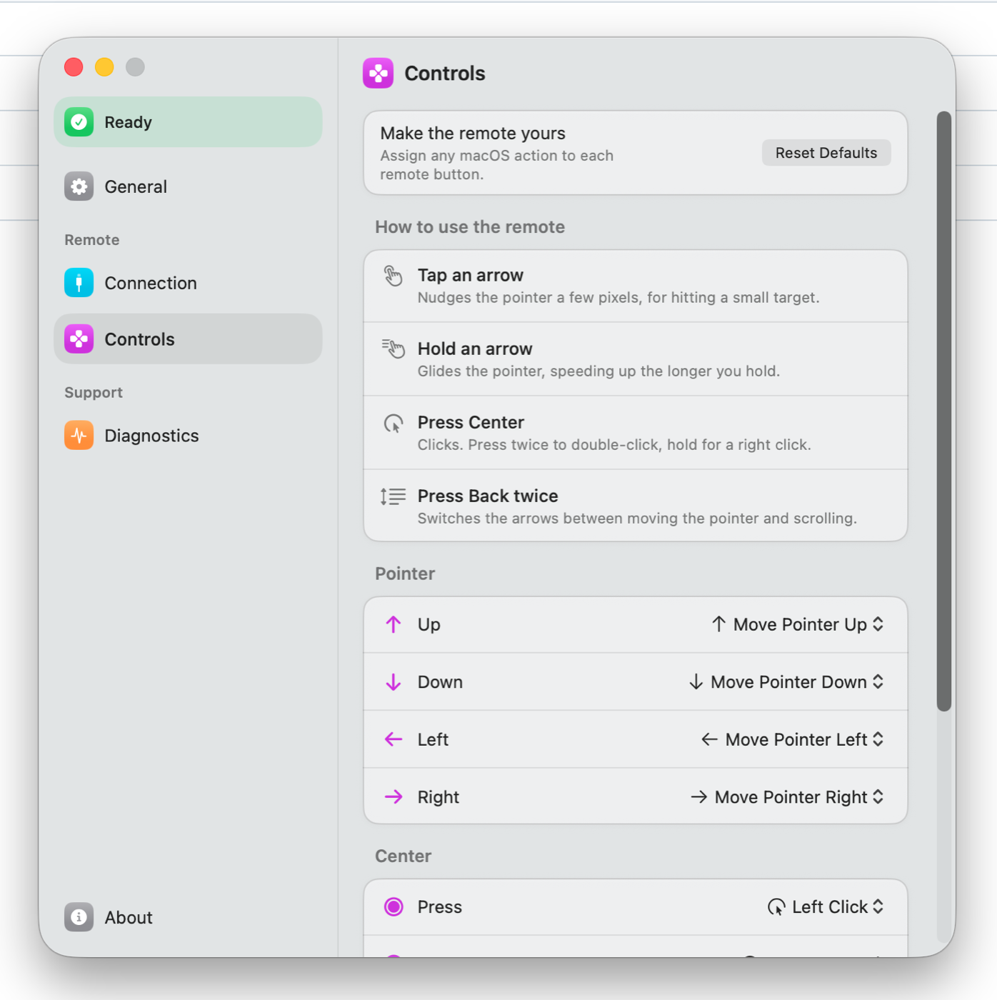

<div align="center">

# Remote Bridge

**Your TV remote becomes a pointer for your Mac, over the HDMI cable you already have.**



</div>

Press the D-pad and the pointer moves. Press Center and it clicks. No dongle,
no extra hardware, nothing to plug in.

Requires macOS 15 or later, a Mac with an HDMI port, and a display that
forwards its remote over HDMI-CEC.

## What the buttons do

| Button | Default |
|---|---|
| D-pad, tapped | Nudges the pointer a few pixels |
| D-pad, held | Glides, accelerating the longer you hold |
| Center | Left click |
| Center, twice | Double click |
| Center, held | Right click |
| Back | Yours to bind |
| Back, twice | Switches the arrows between moving and scrolling |

Every button is reassignable from **Controls**: clicks, scrolling, Escape,
Show Desktop, Mission Control, Back, Forward, middle click, or a keyboard
shortcut you record.

Volume, media and Home never reach the Mac — displays handle those themselves
and keep them off the CEC bus.

## Setup

1. Connect the Mac to the display over HDMI and switch to that input.
2. Turn on HDMI-CEC in the display's settings. Every maker renames it:
   Anynet+ on Samsung, SimpLink on LG, Bravia Sync on Sony. **Connection**
   has the menu path for eight brands.
3. Grant Accessibility under System Settings → Privacy & Security.

The first run walks through all of it and has you practise each gesture, so
you find out the remote works before you rely on it.

## How it works

macOS owns the CEC bus inside the `corercd` daemon. Its private CoreRC XPC
service refuses bus enumeration to third parties — `queryBusesAsync:` answers
`NSOSStatusErrorDomain -6773` — so the daemon routes no HID events to this app.
What it *does* do is log every button, so Remote Bridge reads the unified log:

```
log stream --predicate 'process == "corercd"' --debug --style compact
```

Lines carrying `<User Control Pressed> XX` give the CEC wire code, which the app
maps to a button and posts as a `CGEvent`. Each posted event is stamped in
`kCGEventSourceUserData`, which is how onboarding can tell a remote press from
your own mouse.

```
remote  →  TV  →  HDMI-CEC  →  Mac  →  corercd  →  Remote Bridge  →  pointer
```

This is an experimental use of existing system components rather than a public
API. A macOS update could change it.

## Build

```sh
swift build
swift run RemoteKitTests     # 66 checks
zsh scripts/lint.sh          # formats, then lints
zsh scripts/build-app.sh     # writes build/Remote Bridge.app
```

Requires `brew install swiftlint swiftformat`. See [AGENTS.md](AGENTS.md) for
the architecture and the conventions, and [TODO.md](TODO.md) for what is next.

## Layout

| | |
|---|---|
| `Sources/RemoteKit` | The core, with no UI: CEC transport and log parsing, gesture rules, the glide curve, input synthesis, bindings |
| `Sources/RemoteBridge` | The app: menu bar item, settings window, onboarding |
| `Tests/RemoteKitTests` | A plain executable — Command Line Tools ships neither XCTest nor swift-testing |

## Licence

MIT. See [LICENSE](LICENSE).

`NavigationMethod` and `NavigationSwipe` follow research published by
[Mac Mouse Fix](https://github.com/noah-nuebling/mac-mouse-fix), whose author
tested roughly forty apps to work out which of them respond to mouse buttons,
gesture swipes or keyboard shortcuts for Back and Forward.
