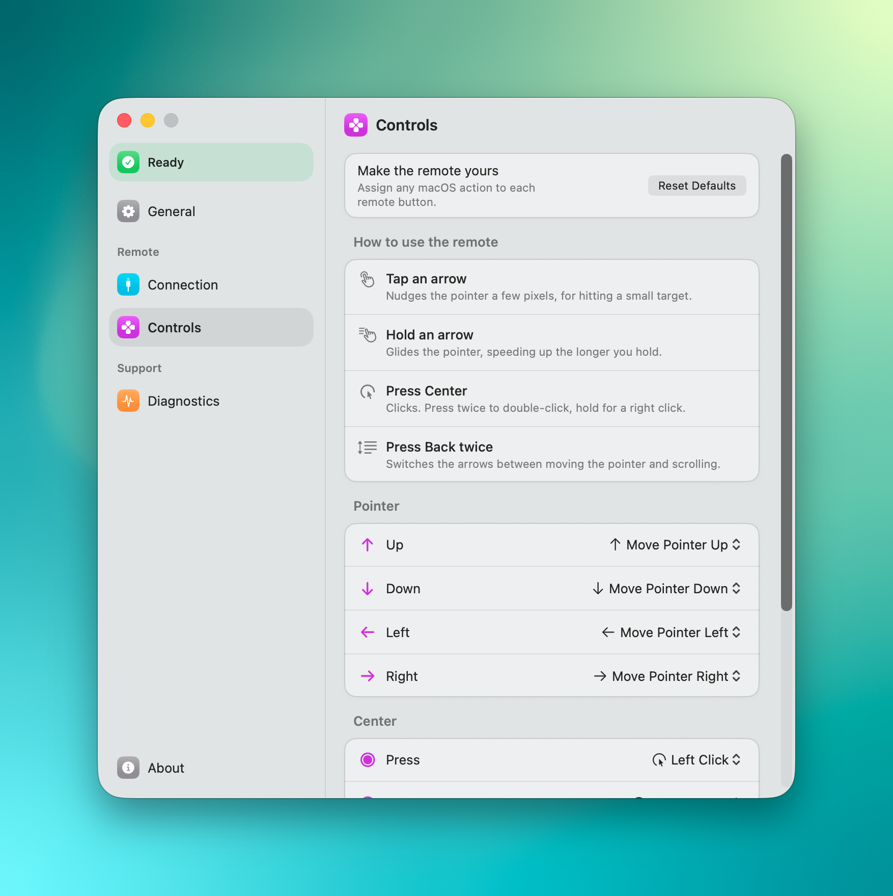

<h1 align="center">Remote Bridge</h1>

<p align="center">
  
  <a href="https://github.com/techwithanirudh/remote-bridge/actions/workflows/ci.yml"></a>
  
  <a href="LICENSE"></a>
</p>

<p align="center">
  <b>Your TV remote becomes a pointer for your Mac, over the HDMI cable you already have.<br />
  No dongle, no extra hardware, nothing to plug in.</b>
</p>

<p align="center">
  <a href="#setup">Setup</a> ·
  <a href="#what-the-buttons-do">Buttons</a> ·
  <a href="#how-it-works">How it works</a> ·
  <a href="docs/ARCHITECTURE.md">Architecture</a> ·
  <a href="AGENTS.md">Contributing</a>
</p>

<p align="center">
  
</p>

## Why Remote Bridge

- **Nothing to buy.** It uses the HDMI cable already carrying your picture, and the remote already in your hand.
- **Every button is yours.** Point, scroll, click, right click, Escape, Show Desktop, Mission Control, Back, Forward, or a keyboard shortcut you record.
- **Nothing leaves your Mac.** No account, no network, no analytics.
- **It tells you when it cannot work.** A live status, a setup checklist per TV brand, and an event log showing exactly what arrived.

## Features

- **Move the pointer with the D-pad**: tap to nudge, hold to glide, accelerating the longer you hold
- **Click without a mouse**: press Center to click, twice to double click, hold for a right click
- **Scroll with the same arrows**: press Back twice to switch modes, with a chip beside the pointer showing which you are in
- **Rebind anything**: twenty actions grouped by kind, including recorded keyboard shortcuts

## What the buttons do

| Button | Default |
| --- | --- |
| D-pad, tapped | Nudges the pointer a few pixels |
| D-pad, held | Glides, accelerating the longer you hold |
| Center | Left click |
| Center, twice | Double click |
| Center, held | Right click |
| Back | Back |
| Back, twice | Switches the arrows between moving and scrolling |
| Back, held | Forward |

Volume, media and Home never reach the Mac. Displays handle those themselves
and keep them off the CEC bus.

## Setup

1. Connect the Mac to the display over HDMI and switch to that input.
2. Turn on HDMI-CEC in the display's settings. Every maker renames it: Anynet+
   on Samsung, SimpLink on LG, Bravia Sync on Sony. **Connection** has the menu
   path for eight brands.
3. Grant Accessibility under System Settings, Privacy & Security.

The first run walks through all of it and has you practise each gesture, so you
find out the remote works before you rely on it.

## How it works

macOS keeps the CEC bus inside the `corercd` daemon. Its private CoreRC XPC
service refuses bus enumeration to third parties, answering
`NSOSStatusErrorDomain -6773`, so the daemon routes no HID events to this app.
What it does do is log every button, so Remote Bridge reads the unified log:

```sh
log stream --predicate 'process == "corercd"' --debug --style compact
```

Lines carrying `<User Control Pressed> XX` give the CEC wire code, which the app
maps to a button and posts as a `CGEvent`. Every posted event is stamped in
`kCGEventSourceUserData`, which is how onboarding tells a remote press from your
own mouse.

```
remote → TV → HDMI-CEC → Mac → corercd → Remote Bridge → pointer
```

## Build

```sh
swift build
swift run RemoteKitTests     # 68 checks
swiftformat . && swiftlint   # needs TOOLCHAIN_DIR, see AGENTS.md
zsh scripts/build-app.sh     # writes build/Remote Bridge.app
```

| Path | What lives there |
| --- | --- |
| `Sources/RemoteKit` | The core, with no UI: CEC transport and parsing, gesture rules, the glide curve, input synthesis, bindings |
| `Sources/RemoteBridge` | The app: menu bar item, settings window, onboarding |
| `Tests/RemoteKitTests` | A plain executable, since Command Line Tools ships neither XCTest nor swift-testing |

[docs/ARCHITECTURE.md](docs/ARCHITECTURE.md) covers how it fits together,
[AGENTS.md](AGENTS.md) the conventions, [TODO.md](TODO.md) what is next.

## License

MIT. See [LICENSE](LICENSE).
