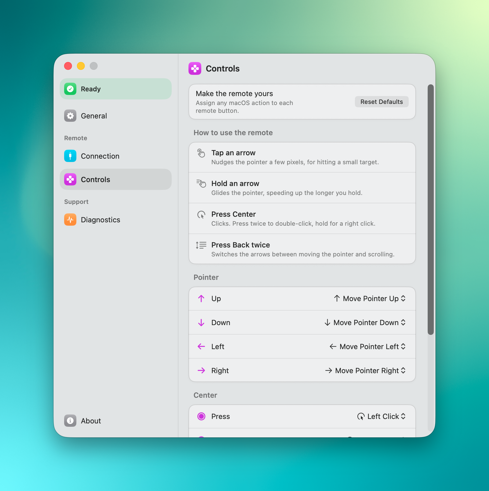

<h1 align="center">Remotely</h1>

<p align="center">
  
  <a href="https://github.com/techwithanirudh/remotely/actions/workflows/ci.yml"></a>
  
</p>

<p align="center">
  <b>Turns your display's remote into a mouse.</b>
</p>

<p align="center">
  <a href="#features">Features</a> ·
  <a href="#buttons">Buttons</a> ·
  <a href="#setup">Setup</a> ·
  <a href="#build">Build</a> ·
  <a href="#resources">Resources</a> ·
  <a href="#acknowledgements">Acknowledgements</a> ·
  <a href="#license">License</a>
</p>

<p align="center">
  
</p>

## Features

- **Scroll with the same arrows**, with a chip beside the pointer showing the mode
- **Rebind anything**: twenty actions grouped by kind, including recorded keyboard shortcuts
- **Nothing leaves your Mac**: no account, no network, no analytics

## Buttons

| Button | Default |
| --- | --- |
| D-pad, tapped | Nudges the pointer a few pixels |
| D-pad, held | Glides, accelerating the longer you hold |
| Center | Left click |
| Center, twice | Double click |
| Center, held | Right click |
| Back | Back |
| Back, twice | Switches the arrows between moving and scrolling |
| Back, held | Yours to bind |

## Setup

1. Connect the Mac to the display over HDMI and switch to that input.
2. Turn on HDMI-CEC in the display's settings.
3. Grant Accessibility under System Settings, Privacy & Security.

The first run walks through all of it and has you practise each gesture, so you
find out the remote works.

## Build

```sh
swift build
swift run RemotelyKitTests     # 96 checks
swiftformat . && swiftlint   # needs TOOLCHAIN_DIR, see AGENTS.md
zsh scripts/build-app.sh     # writes build/Remotely.app
```

| Path | What lives there |
| --- | --- |
| `Sources/RemotelyKit` | The core, with no UI: CEC transport and parsing, gesture rules, the glide curve, input synthesis, bindings |
| `Sources/Remotely` | The app: menu bar item, settings window, onboarding |
| `Tests/RemotelyKitTests` | A plain executable, since Command Line Tools ships neither XCTest nor swift-testing |

## Resources

- [Architecture](docs/ARCHITECTURE.md)
- [Releasing](docs/RELEASING.md)
- [Contributing](CONTRIBUTING.md)
- [What is next](TODO.md)

## Acknowledgements

- [Loop](https://github.com/MrKai77/Loop) by Kai Azim is the reference for the
  settings window, and a seriously good one. Clash warnings on bindings, the
  update badge, hiding settings that do not apply, sheets for sub-settings,
  staying quiet at login and running one copy at a time all come from reading
  it. Loop is GPL-3.0, so none of its code is copied; [what was taken and
  why](docs/LOOP.md).
- [Mac Mouse Fix](https://github.com/noah-nuebling/mac-mouse-fix) worked out
  which apps take mouse buttons 4 and 5 for Back and Forward and which need a
  swipe or a shortcut. Remotely ports that table.

## License

MIT. See [LICENSE](LICENSE).
