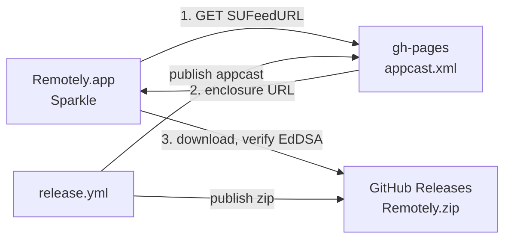

# Releasing

## Who hosts what

| What | Where | URL |
| --- | --- | --- |
| Appcast | `gh-pages` branch, served by GitHub Pages | `https://remotely.techwithanirudh.com/appcast.xml` |
| Update payload | GitHub Releases on this repo | `https://github.com/techwithanirudh/remotely/releases/download/<tag>/Remotely.zip` |

Two hosts, not one, and the split is the part that broke first. `generate_appcast`
writes an enclosure URL next to the appcast unless told otherwise, which pointed
at the Pages host and answered 404 while the archive sat on the release. The
release job passes `--download-url-prefix` for exactly this.

The feed URL is baked into every shipped binary and old installs poll it
forever, so it is a domain we own rather than a `github.io` address.



## Cutting a release

1. Bump `CFBundleShortVersionString` in `Resources/Info.plist`, commit, push.
2. Tag it and push the tag. The tag alone distributes nothing.

   ```sh
   git tag -a 0.7.0 -m 0.7.0 && git push origin 0.7.0
   ```

3. Run the workflow. It is manual on purpose, so tags can be moved or backfilled
   without shipping anything.

   ```sh
   gh workflow run release.yml -f tag=0.7.0 -f channel=auto -f publish=true
   ```

Leave `publish` unchecked for a draft. The appcast is only pushed to `gh-pages`
when `publish` is set, so a draft cannot offer an update to anyone.

## What the job does

1. Runs the test suite. A red suite stops the release.
2. Builds the app and signs it with `CODESIGN_IDENTITY`.
3. Packages with `ditto -c -k --keepParent`, the only archiver that preserves the
   bundle's symlinks, which Sparkle needs intact.
4. Signs the archive with Sigstore, giving provenance without an Apple account.
5. Runs `generate_appcast` with the EdDSA key from `SPARKLE_PRIVATE_KEY`, and
   skips this step entirely if the secret is missing rather than publishing an
   unsigned feed Sparkle would reject.
6. Creates the GitHub release.
7. Publishes `appcast.xml` to `gh-pages` with the `CNAME` and `.nojekyll`.

## Channels

`channel=auto` reads the tag suffix: `-alpha` or `-nightly` gives alpha,
`-beta` or `-rc` gives beta, anything else is stable. A stable entry carries no
`sparkle:channel` attribute, which is what older Sparkle treats as "everyone".
Beta is opt-in through About.

## Secrets and identities

| Name | Where | Notes |
| --- | --- | --- |
| `SPARKLE_PRIVATE_KEY` | repo secret | EdDSA private key. The public half is `SUPublicEDKey` in `Resources/Info.plist`. |
| `CODESIGN_CERTIFICATE` | repo secret | The `Remotely Self Signed` identity as a base64 `.p12`. |
| `CODESIGN_CERTIFICATE_PASSWORD` | repo secret | Password for that `.p12`. |

None of it goes in the working copy. The release job decodes the certificate
into a keychain under `$RUNNER_TEMP`, signs from there, and deletes the keychain
in an `if: always()` step, so a failed run leaves nothing behind. A build that
comes out ad-hoc signed fails the job rather than shipping.

Sign with a stable identity, never ad-hoc. Accessibility is granted against the
designated requirement, and measured across one version bump:

- ad-hoc: `cdhash H"eed024..."` becomes `cdhash H"e5f28c..."`, so macOS reads
  every build as a different app and drops the grant
- self-signed: `identifier "com.anirudh.remotely" and certificate root =
  H"13f1de..."`, unchanged

Losing the certificate means every existing install loses its Accessibility
grant on the next update. Losing the EdDSA key means no existing install can be
updated at all. Both live in the login keychain locally and in repo secrets for CI.

Notarization is unrelated to any of this. It silences Gatekeeper on first launch
and needs a paid Apple account, which this does not have, so a first install
still needs right-click then Open.

## Related

- [VERIFYING_RELEASES.md](VERIFYING_RELEASES.md)
- [ARCHITECTURE.md](ARCHITECTURE.md)
